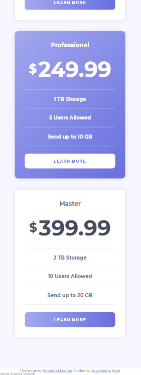

# Frontend Mentor - Pricing component with toggle solution

A pricing component with a toggle button that shows annually and monthly plans.

## Installation

This project is made by only html and css and vanilla javascript so you just need a browser to run it.

## Overview

 

- [Live-Demo](https://ali-pricing-component-with-toggle.netlify.app/)
- [Solution URL](https://www.frontendmentor.io/solutions/introcomponentwithsignupformmaster-cUQ0TDtHiO)

### Built with

- Semantic HTML5 markup
- CSS custom properties
- CSS Grid
- Mobile-first workflow
- Vanilla javascript

### Challange

Users should be able to:

- View the optimal layout for the component depending on their device's screen size
- Control the toggle with both their mouse/trackpad and their keyboard

## Credits

This is a solution to the [Pricing component with toggle challenge on Frontend Mentor](https://www.frontendmentor.io/challenges/pricing-component-with-toggle-8vPwRMIC). Frontend Mentor challenges help you improve your coding skills by building realistic projects.

## Author

- Website - [Ali Mashayekhi]()
- X (twitter) - [@alimashayekhi42](https://www.twitter.com/alimashayekhi42)
- Frontend Mentor - [@ali-mashayekhi](https://www.frontendmentor.io/profile/ali-mashayekhi)
